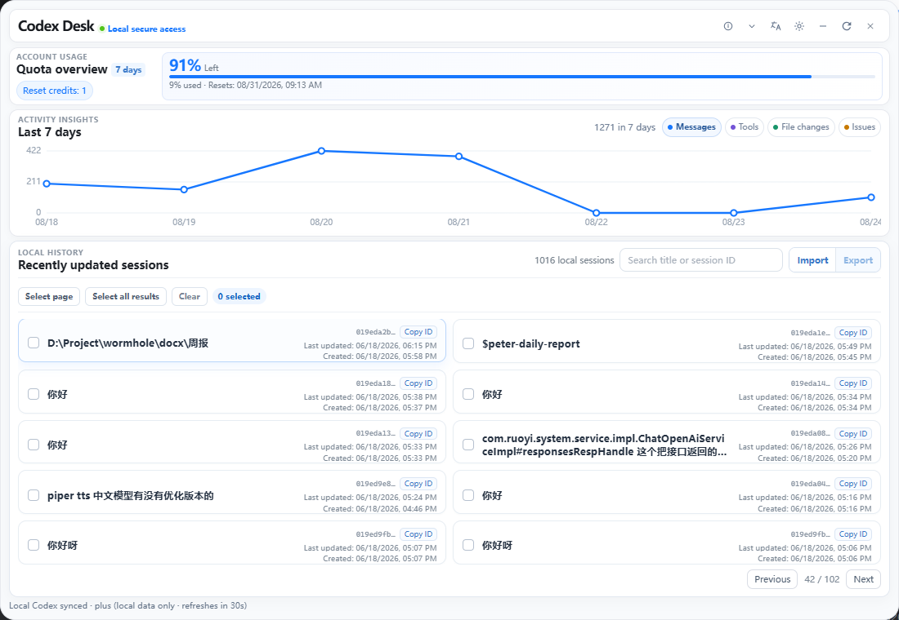
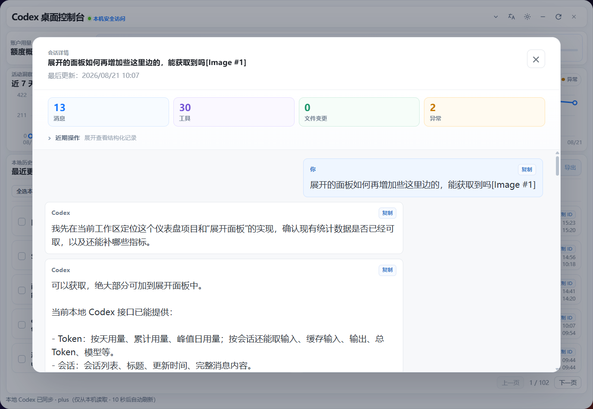
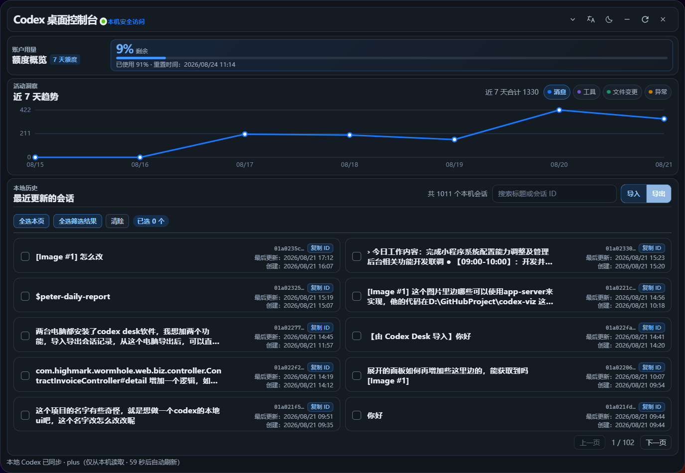

# Codex Desk

[中文](README.md)

[](https://github.com/xiaotao-xiaotao/codex-desk/releases)
[](LICENSE)
[](https://github.com/xiaotao-xiaotao/codex-desk/stargazers)

**A lightweight desktop control center for Codex.**

Codex Desk is designed for developers who use Codex CLI. It keeps a floating usage indicator on your desktop and provides local session browsing, activity trends, session insights, and cross-device session migration.

All data is read through the local `codex app-server --stdio` process. Codex Desk does not upload your data to a third-party service, read or save `auth.json`, or call account APIs.

If Codex Desk helps you manage your sessions, please consider giving the project a **Star**. Feedback and bug reports are welcome through [Issues](https://github.com/xiaotao-xiaotao/codex-desk/issues).

## Download

Download the latest installer from [Releases](https://github.com/xiaotao-xiaotao/codex-desk/releases):

- **Windows**: download the `.exe` installer for Windows 10/11.
- **macOS**: download the matching `.app` or `.dmg` package. Distribution to other users usually requires Apple signing and notarization.

Before launching the app, install and sign in to [Codex CLI](https://github.com/openai/codex) separately. The ChatGPT desktop app does not provide the `codex` command or the `app-server` protocol.

## Features

- **Usage overview**: view the current plan, quota window, usage percentage, and reset time.
- **Seven-day activity trends**: switch between messages, tool calls, file changes, and errors in a code-drawn line chart.
- **Local sessions**: browse non-archived local sessions, search by title or session ID, and view creation and update times.
- **Session details and insights**: inspect user messages and Codex replies, copy individual messages, and review aggregate activity metrics.
- **Session import and export**: export selected sessions as portable Codex Desk bundles and import them as new sessions on another signed-in device.
- **Local data boundary**: data is obtained from the local Codex app server; local JSONL files and authentication data are not parsed or stored by the app.

## Screenshots

<p align="center">
  
</p>

### Dashboard



### Session details



### Dark mode



## Import and export

Import and export are intended for migrating or backing up **conversation text**, not for backing up the complete local Codex runtime state. Export files are unencrypted JSON; store them carefully and do not upload them to untrusted locations.

Only Codex Desk v1 bundles are supported. The app does not import Codex JSONL files or arbitrary JSON files. A single file is limited to 64 MB, and one operation supports up to 5,000 sessions.

## Requirements

- Node.js 20 or later
- Rust stable toolchain (only required for development and packaging), installed with `rustup`
- Codex CLI installed and signed in
- WebView2 on Windows (normally included with Windows 10/11)

## Development

```powershell
npm install
npm run tauri dev
```

On macOS, the same commands can be run from the project directory:

```bash
npm install
npm run tauri dev
```

## Build

```powershell
npm run tauri build
```

Build artifacts are generated under `src-tauri/target/release/bundle/`. Windows builds include an installer; macOS builds can produce `.app` and `.dmg` packages.

## Usage

- Click the floating usage orb to show or hide the dashboard.
- Switch trend metrics below the quota section.
- Search, inspect, import, or export local sessions from the session list.
- Drag the title area to reposition the floating window.
- The app refreshes automatically every 60 seconds; use the refresh button for an immediate update.
- Closing the window hides it. Use the system tray menu to show the dashboard again.

## License

See [LICENSE](LICENSE).
