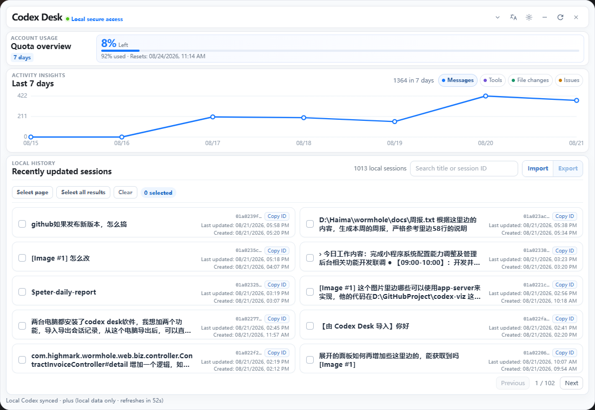

# Codex Desk

[English](README.en.md)

[](https://github.com/xiaotao-xiaotao/codex-desk/releases)
[](LICENSE)
[](https://github.com/xiaotao-xiaotao/codex-desk/stargazers)

**一个轻量、常驻桌面的 Codex 本地控制台。**

Codex Desk 面向已经安装并登录 Codex CLI 的开发者，在桌面悬浮显示额度状态，并提供本地会话浏览、趋势分析、详情洞察和跨设备迁移。数据通过本机 `codex app-server --stdio` 获取，不上传到第三方服务。

如果它帮你更方便地管理 Codex 会话，欢迎点一个 **Star**，也欢迎通过 Issue 提交建议。

## 下载

前往 [Releases](https://github.com/xiaotao-xiaotao/codex-desk/releases) 下载最新安装包：

- Windows：下载 `.exe` 安装包（Windows 10/11）
- macOS：当前未提供预构建安装包，需要在 macOS 环境中自行构建 `.app` 或 `.dmg`。如果要分发给其他用户，通常还需要进行 Apple 签名和公证。

macOS 构建命令见下方[开发启动](#开发启动)和[打包](#打包)章节。

首次启动前，请确保已单独安装并登录 [Codex CLI](https://github.com/openai/codex)。

## 界面预览

以下截图展示悬浮额度球、会话总览与会话详情界面。

<p align="center">
  
</p>

### 展开总览


### 会话详情


### 暗黑模式


### 英文界面



## 多语言支持

应用支持以下界面语言：简体中文、繁體中文、English、日本語和한국어。

- 选择“跟随系统”时，应用会根据操作系统语言自动选择界面语言。
- 也可以在应用右上角的语言菜单中手动切换。
- 语言偏好会保存在本机，下次启动时继续使用。

## 功能概览

- **额度概览**：展示当前套餐、额度窗口、已用比例和重置时间。
- **近 7 天趋势**：以代码绘制可切换的折线趋势图，可查看消息、工具调用、文件变更和异常四个维度。
- **本地会话**：读取本机非归档的持久化会话，每页展示 10 个；支持按标题或会话 ID 模糊搜索，并同时显示创建时间与最后更新时间。
- **会话详情与洞察**：查看用户消息和 Codex 回复、复制单条内容，并汇总消息数、工具调用数、文件变更数和异常数；可展开查看最近 30 条结构化操作记录。
- **会话导入导出**：可选择单个会话、当前页或全部筛选结果，导出为可移植的 Codex Desk 会话包；可在另一台已登录 Codex CLI 的设备中导入为新会话。
- **本地数据边界**：所有数据均通过本机 `codex app-server --stdio` 获取；不读取或解析本地 JSONL、不会读取或保存 `auth.json`，也不会调用账号信息接口。

## 统计口径

- 趋势图展示最近 7 个自然日。消息按所属回合的时间归档；回合时间缺失时，才使用会话最后更新时间作为回退。
- 趋势只读取最近更新的最多 100 个本机非归档会话，避免为历史会话进行大量详情读取；会话列表、搜索和导出不受这个 100 条范围限制。
- 趋势的“消息”仅统计可识别的用户消息和 Codex 回复。每个会话最多纳入最新 500 条消息，与详情页的消息展示上限一致。
- 详情页上方的四项洞察基于该会话返回的全部可识别回合汇总；因此其中的消息数可能大于详情区域实际显示的 500 条消息。
- 趋势数据缓存 60 秒；手动刷新会跳过缓存并重新聚合。

## 会话导入与导出

导入导出用于迁移或备份**对话文本**，不是对 Codex 本地运行状态的完整备份。文件为未加密的 JSON，请妥善保存，不要上传到不可信位置。

### 导出会话

1. 展开看板，在“本地历史”区域用每张会话卡片左侧的复选框选择会话。
2. 可点击“全选本页”，或先搜索后点击“全选筛选结果”跨页选择全部匹配项；“清除”会取消当前选择。
3. 选中至少一个会话后点击“导出”，在系统“另存为”窗口中选择位置和文件名。
4. 默认文件名包含导出日期，扩展名为 `.codex-desk.json`。完成后，底部状态栏会显示成功数量；个别会话读取失败不会中断其余会话的导出。

导出包格式为 `codex-desk-thread-bundle` v1，包含导出时间、原会话 ID、标题、创建/更新时间及可识别的用户消息和 Codex 回复。不包含认证信息、插件或 Skill 配置、本机文件路径、工具调用、命令执行记录、文件变更、补丁和详情洞察数据。

### 导入会话

1. 在“本地历史”区域点击“导入”，选择由 Codex Desk 导出的 `.codex-desk.json` 文件。
2. 应用会显示待导入会话数量和可能产生少量额度消耗的确认提示；确认后开始导入。
3. 每条成功导入的数据都会创建一个**新的**本机 Codex 会话，标题带有当前界面语言对应的“由 Codex Desk 导入”前缀，并写入一条只读、禁网的历史上下文回合。
4. 导入完成后会自动刷新会话列表和趋势图；新会话也可在 `codex resume` 中通过标题前缀识别。

导入不会覆盖、合并或删除原会话，也不会复用原会话 ID；重复导入同一个文件会创建重复的新会话。原始创建/更新时间仅保留在导出文件中，导入后的新会话以实际导入时间为准。

仅支持由 Codex Desk 导出的 v1 会话包，不支持直接导入 Codex JSONL、任意 JSON 或其他工具的导出文件。单个文件最大 64 MB，单次最多导入或导出 5,000 个会话。

## 运行要求

- Node.js 20 或更高版本
- Rust（仅开发、打包所需）：使用 `rustup` 安装稳定版工具链
- 已安装并登录 Codex CLI；本应用通过 `codex app-server --stdio` 读取额度和会话数据，不读取或保存 `auth.json`
- Windows 需要 WebView2（Windows 10/11 通常已内置）

> **ChatGPT 客户端不能替代 Codex CLI。** 即使已安装并登录 ChatGPT 桌面客户端，它也不会提供 `codex` 命令或 `app-server` 标准输入输出协议；未单独安装 Codex CLI 时，Codex Desk 无法读取额度、会话和趋势，也无法执行会话导入导出。安装 Codex CLI 后可使用同一个 ChatGPT/OpenAI 账号登录。

## 开发启动

```powershell
Set-Location "<Codex Desk 项目目录>"
npm install
npm run tauri dev
```

如果 PowerShell 提示找不到 `cargo`，说明 Rust 安装目录尚未加入 `PATH`。先将实际安装目录加入当前终端；例如本机自定义安装在 D 盘时：

```powershell
$toolchainBin = "$env:USERPROFILE\.rustup\toolchains\stable-x86_64-pc-windows-msvc\bin"
$env:Path = "$toolchainBin;D:\Software\Rust\cargo\bin;$env:Path"
npm run tauri dev
```

建议随后将 Rust 的 `cargo\bin` 目录加入用户 `PATH`，避免每次都要设置。

macOS 的同一项目可直接执行：

```bash
cd <Codex Desk 项目目录>
npm install
npm run tauri dev
```

## 打包

```powershell
npm run tauri build
```

输出位置：`src-tauri/target/release/bundle/`。Windows 可得到安装包，macOS 可构建 `.app`/`.dmg`；向其他 macOS 用户分发前通常需要 Apple 签名和公证。

## 使用方式

- 点击额度球：展开或收起本地看板。
- 展开后可在额度区域下方查看近 7 天趋势，点击“消息 / 工具 / 文件变更 / 异常”切换指标。
- 本地会话支持按标题或会话 ID 模糊搜索；可勾选后导入、导出，点击会话可查看详情，复制会话 ID 或单条消息内容。
- 会话详情最多展示最新 500 条可识别消息；上方洞察区展示汇总指标，展开“近期操作”可查看结构化记录。
- 应用启动后会常驻一个本机 `codex app-server` 进程；额度、会话、详情和趋势请求会严格串行复用该连接，退出应用时会将其关闭。
- 展开后可拖动标题区域改变悬浮位置。
- 每 60 秒自动刷新，点击刷新按钮可立即更新。
- 点击关闭按钮只隐藏悬浮窗；从系统托盘菜单“显示额度”可再次打开。
