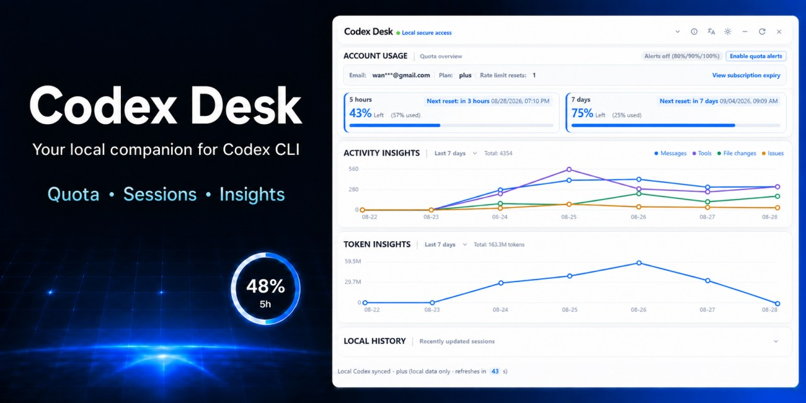
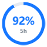
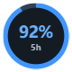
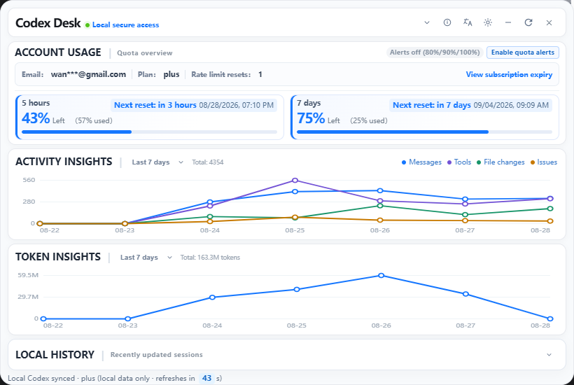
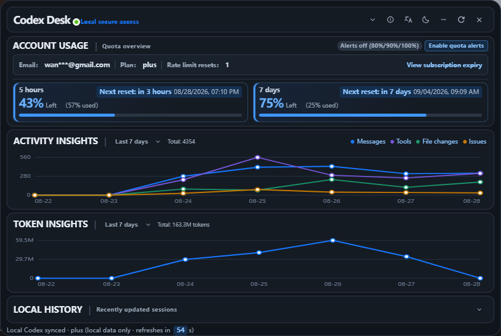
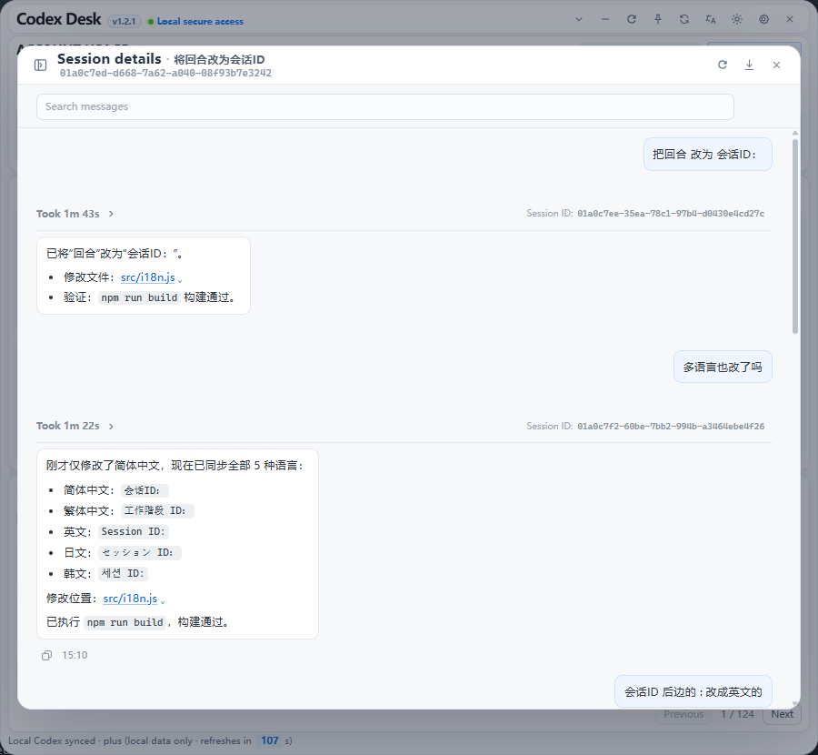

# Codex Desk

[中文](README.zh-CN.md)

[](https://github.com/xiaotao-xiaotao/codex-desk/releases)
[](LICENSE)
[](https://github.com/xiaotao-xiaotao/codex-desk/stargazers)

<p align="center">
  
</p>

**Keep track of Codex CLI quota and quickly resume local sessions.**

Codex Desk is a privacy-first desktop control center for Codex CLI. It keeps a floating quota indicator on your desktop and provides quota alerts, account and usage overviews, local session browsing, activity and Token trends, session insights, and cross-device session migration.

Data is obtained through the local `codex app-server --stdio` process. Codex Desk does not upload your data to a third-party service or read or save `auth.json`.

If Codex Desk helps you manage your sessions, please consider giving the project a **Star**. Feedback and bug reports are welcome through [Issues](https://github.com/xiaotao-xiaotao/codex-desk/issues).

## Download

Download the latest installer from [Releases](https://github.com/xiaotao-xiaotao/codex-desk/releases):

- **Windows**: download the `.exe` installer for Windows 10/11.
- **macOS**: download the `.dmg` installer that matches your Mac's chip.
- **Linux**: download the `.deb` package for Debian/Ubuntu, or the `.AppImage` package for most other desktop distributions.

Before launching the app, install and sign in to [Codex CLI](https://github.com/openai/codex) separately. The ChatGPT desktop app does not provide the `codex` command or the `app-server` protocol.

### macOS installation

1. From [Releases](https://github.com/xiaotao-xiaotao/codex-desk/releases), download the `.dmg` for your chip: choose the filename containing `aarch64` for Apple silicon (M-series), or `x64` for Intel Macs. You can check your chip in **About This Mac**.
2. Open the `.dmg` and drag `Codex Desk.app` into the **Applications** folder.
3. The current packages are not yet Apple-signed or notarized. Only if you downloaded the package from this project's Releases page, `Control`-click `Codex Desk` in **Applications**, choose **Open**, then confirm **Open** once more if macOS blocks it.
4. If it is still blocked, go to **System Settings → Privacy & Security** and select **Open Anyway** beside the security notice.

After installation, you still need to install and sign in to Codex CLI separately; Codex Desk does not include or replace it.

### First launch in two steps

1. Install and sign in to Codex CLI: `npm install -g @openai/codex`, then run `codex` to complete sign-in.
2. Launch Codex Desk. If quota is unavailable, use the top-right **Diagnose Codex CLI** button to check the CLI, `app-server`, and quota access. Diagnostic results can be copied into an Issue.

## Features

- **Account and usage overview**: view a masked sign-in email, current plan, quota windows, usage percentage, reset time, available rate-limit resets, and a link to the official billing portal.
- **Quota alerts**: after you explicitly enable native notifications, get one alert per reset window at 80%, 90%, and 100% usage.
- **Activity trends**: view the last 3, 7, or 30 days and independently show or hide messages, tool calls, file changes, and errors in a code-drawn line chart.
- **Token insights**: view daily Token usage and totals for the last 3, 7, or 30 days when the local Codex app server provides usage data.
- **Local sessions**: browse non-archived local sessions, search by title or session ID, and view creation and update times.
- **Session details and insights**: inspect user messages and Codex replies, enlarge images in a dedicated preview, copy messages with images when the system clipboard supports rich content, and review aggregate activity metrics.
- **File change comparison**: open recorded file changes from recent activity and compare diffs side by side or inline. Historical diffs are shown from the session record and are not read from the current workspace.
- **Resume quickly**: copy `codex resume <session ID>` from session details and continue the session in your terminal.
- **Session import and export**: export selected sessions as portable Codex Desk bundles and import them as new sessions on another signed-in device.
- **Local data boundary**: account, quota, Token, and session data are obtained through the local Codex app server; local JSONL files and authentication data are not parsed or stored by the app.
- **Local diagnostics**: diagnostics only check the local CLI, `app-server`, and quota access; no auth file is read and no data is uploaded.

## Screenshots

<p align="center">
  
  
</p>

### Dashboard





### Session details



## Multilingual support

The app provides five interface languages: Simplified Chinese, Traditional Chinese, English, Japanese, and Korean.

- In **System** mode, the app selects a language based on your operating system language.
- You can also switch languages manually from the language menu in the top-right corner.
- Your language preference is stored locally and restored on the next launch.

## Import and export

Import and export are intended for migrating or backing up **conversation text**, not for backing up the complete local Codex runtime state. Export files are unencrypted JSON; store them carefully and do not upload them to untrusted locations.

Only Codex Desk v1 bundles are supported. The app does not import Codex JSONL files or arbitrary JSON files. A single file is limited to 64 MB, and one operation supports up to 5,000 sessions.

## Requirements

- Node.js 24 or later
- Rust stable toolchain (only required for development and packaging), installed with `rustup`
- Codex CLI installed and signed in
- WebView2 on Windows (normally included with Windows 10/11)

## Development

```powershell
npm install
npm run tauri dev
```

On macOS, the same commands can be run from the project directory:

```bash
npm install
npm run tauri dev
```

## Build

```powershell
npm run tauri build
```

Build artifacts are generated under `src-tauri/target/release/bundle/`. Windows builds include an installer; macOS builds can produce `.app` and `.dmg` packages.

## Usage

- Click the floating usage orb to show or hide the dashboard.
- Use the top-right diagnostic button to verify the local connection and optionally enable 80% / 90% / 100% quota alerts.
- Choose a 3-, 7-, or 30-day range for activity and Token trends, then toggle the activity metrics you want to compare.
- Search, inspect, import, or export local sessions from the session list. In session details, open recorded file diffs, or double-click an image to enlarge it.
- Copy `codex resume <session ID>` from a session detail page to continue it in the terminal.
- Drag the title area to reposition the floating window.
- The app refreshes automatically every 60 seconds and shows the countdown in the status bar; use the refresh button for an immediate update.
- Closing the window hides it. Use the system tray menu to show the dashboard again.

## License

See [LICENSE](LICENSE).
