# Codex Desk

<p align="center">
  <strong>掌握 Codex CLI 额度，便捷切换账户，快速继续本地会话。</strong><br />
  面向 Windows、macOS 和 Linux 的本地 Codex CLI 桌面控制台。
</p>

<p align="center">
  <a href="https://github.com/xiaotao-xiaotao/codex-desk/releases"><strong>下载最新版本</strong></a>
  · <a href="README.md">English</a>
</p>

<p align="center">
  <a href="https://github.com/xiaotao-xiaotao/codex-desk/releases"></a>
  <a href="LICENSE"></a>
  <a href="https://github.com/xiaotao-xiaotao/codex-desk/stargazers"></a>
</p>

## 主要功能

- **额度查看**：剩余额度、重置时间、悬浮球与自定义提醒。
- **账户管理**：浏览器或设备码登录，本机保存与切换账户。
- **数据洞察**：Token 活跃日历、用量趋势、会话分布与主题词云。
- **本地会话**：标题搜索、固定、消息记录、文件对比与 `codex resume` 命令；消息搜索覆盖已加载历史。
- **分类设置**：连接、提醒、隐私与阅读偏好，支持阅读预览。
- **桌面功能**：可收起侧栏、明暗主题、系统托盘与五种界面语言。

需要 **Codex CLI ≥ 0.157.0**（[安装说明](https://github.com/openai/codex)）。

## 下载

前往 [Releases](https://github.com/xiaotao-xiaotao/codex-desk/releases) 下载最新安装包：

- Windows：普通用户下载 `.exe` 安装包（Windows 10/11）；企业或集中部署可选择 `.msi` 安装包。
- macOS：下载与芯片匹配的 `.dmg` 安装包。
- Linux：Debian/Ubuntu 下载 `.deb`；Fedora 等兼容 RPM 的发行版下载 `.rpm`；其他桌面发行版可下载 `.AppImage`。

首次启动前，请确保已单独安装并登录 [Codex CLI](https://github.com/openai/codex)，版本需 **≥ 0.157.0**。

### macOS 安装说明

1. 在 [Releases](https://github.com/xiaotao-xiaotao/codex-desk/releases) 下载对应芯片的 `.dmg`：M 系列芯片选择文件名含 `aarch64` 的安装包，Intel 芯片选择含 `x64` 的安装包。可在“关于本机”中查看芯片类型。
2. 双击打开 `.dmg`，将 `Codex Desk.app` 拖到“应用程序（Applications）”文件夹。
3. 当前安装包尚未完成 Apple 签名和公证。仅当确认安装包来自本项目 Releases 时，如被 macOS 拦截，请在“应用程序”中按住 `Control` 点击 `Codex Desk`，选择“打开”，再点击一次“打开”。
4. 如果仍被拦截，前往“系统设置 → 隐私与安全性”，在安全提示旁点击“仍要打开”。

完成安装后，仍需单独安装并登录 Codex CLI；Codex Desk 不会替代或内置 Codex CLI。

### 首次启动只需两步

1. 安装并登录 Codex CLI：`npm install -g @openai/codex`，随后执行 `codex` 完成登录。
2. 启动 Codex Desk；若看不到额度，可在设置中心确认 Codex CLI 路径，然后点击“立即刷新”重试。

## 界面预览

截图使用示例数据，邮箱已脱敏；动态图展示页面导航，不执行真实账户切换。

### 动态演示

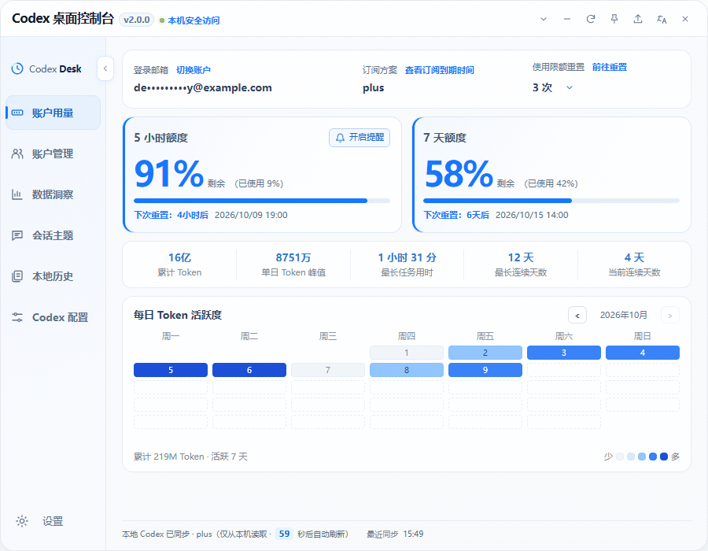

### 账户用量

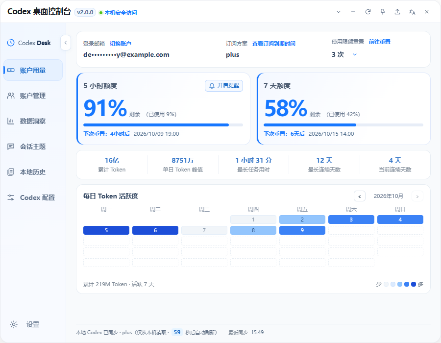

<p align="center">
  
</p>

### 多账户管理

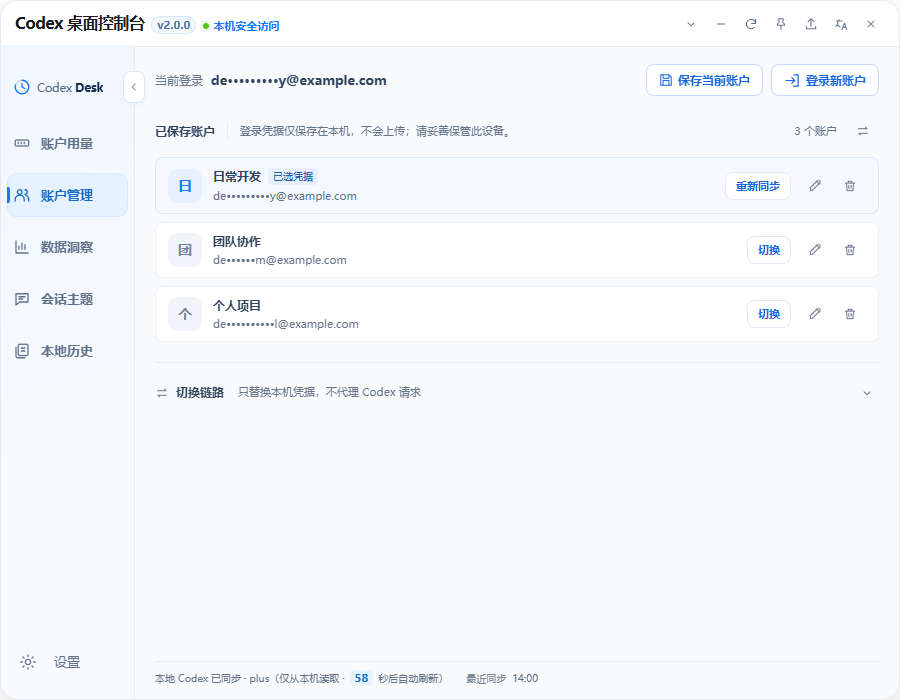

<details>
<summary>查看登录、切换确认与本地切换链路</summary>

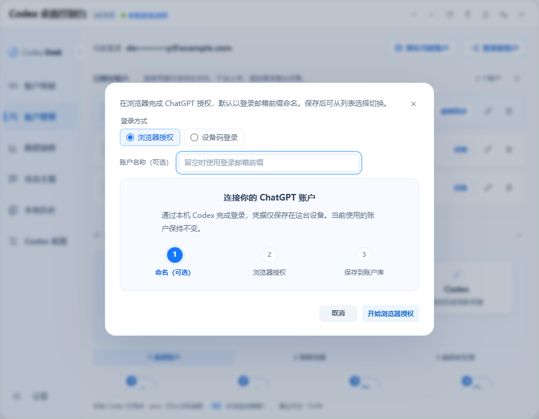


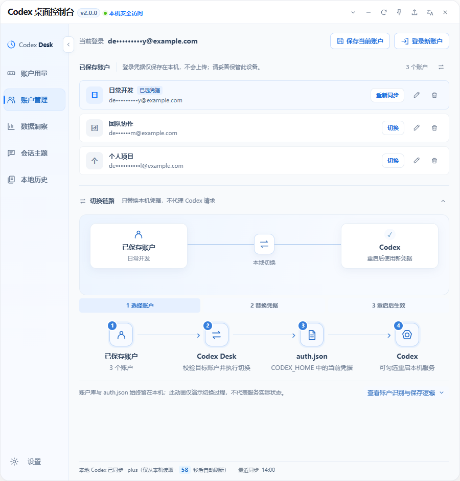

</details>

### 分类设置

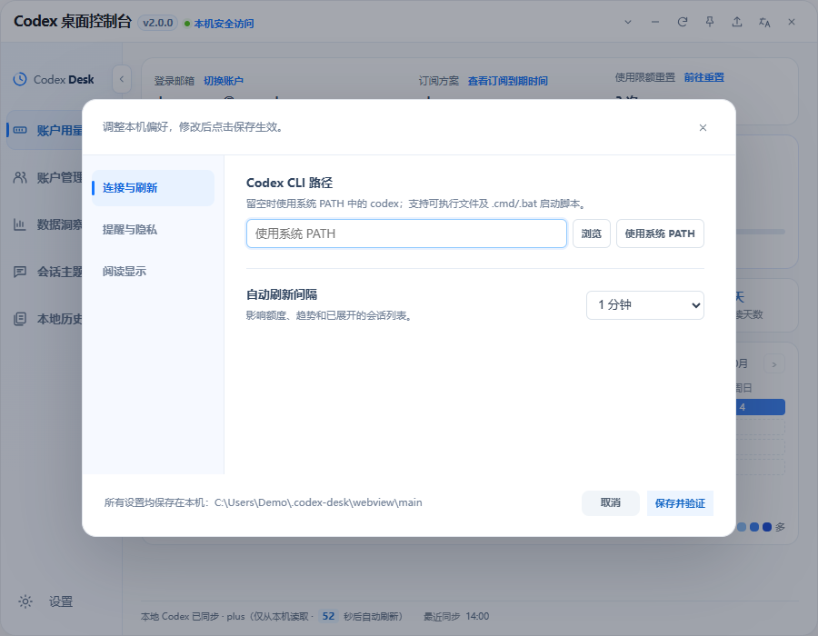

<details>
<summary>查看提醒与隐私、阅读显示及实时预览</summary>

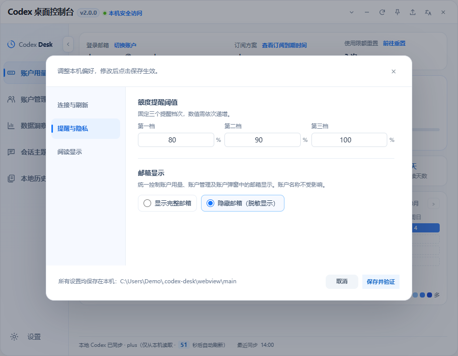

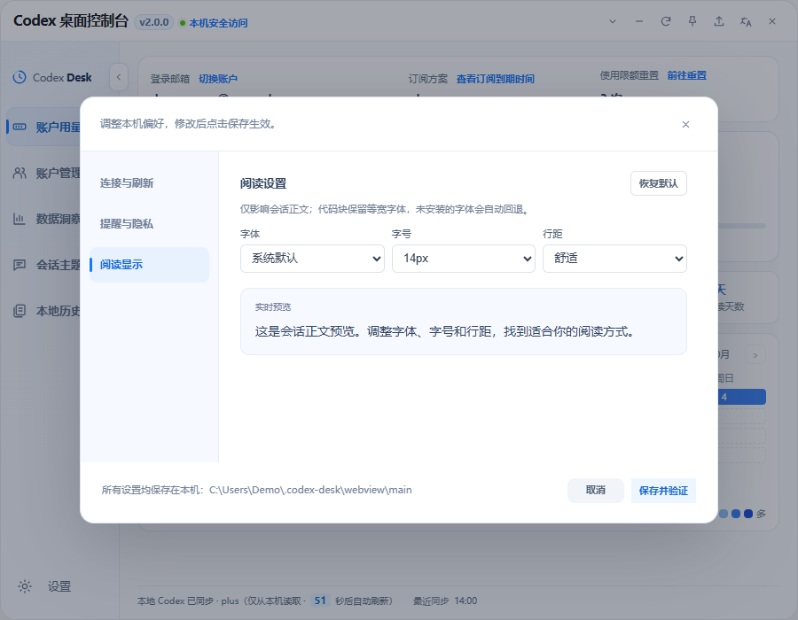

</details>

<details>
<summary>查看数据洞察、会话主题、本地历史与文件对比</summary>

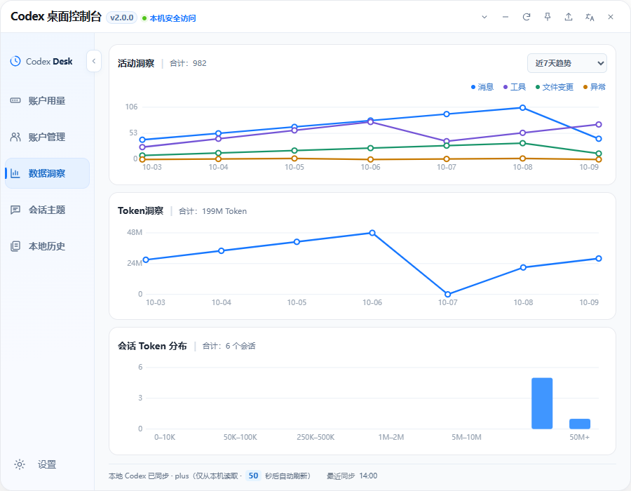

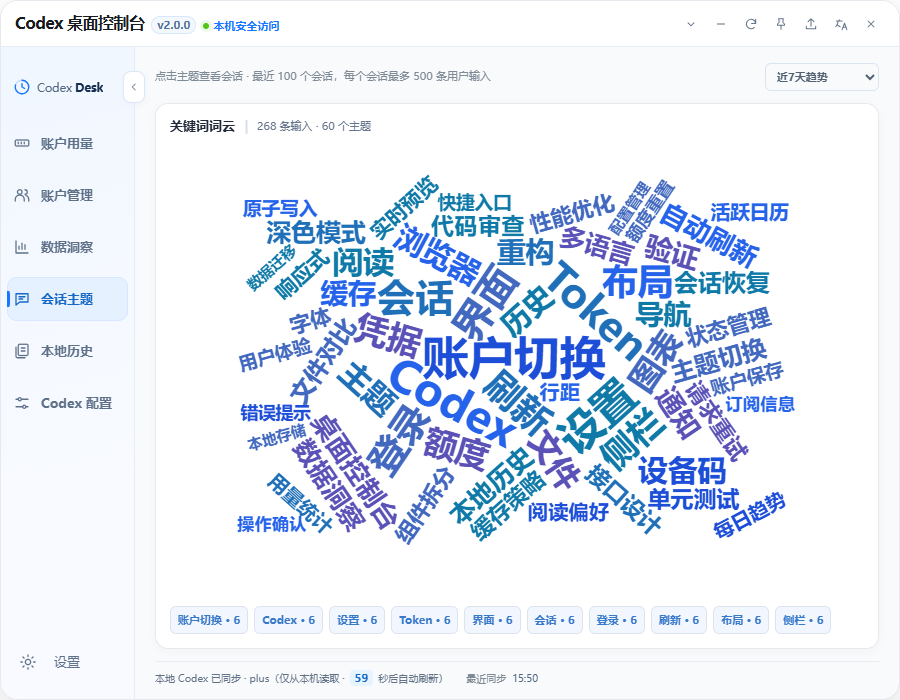

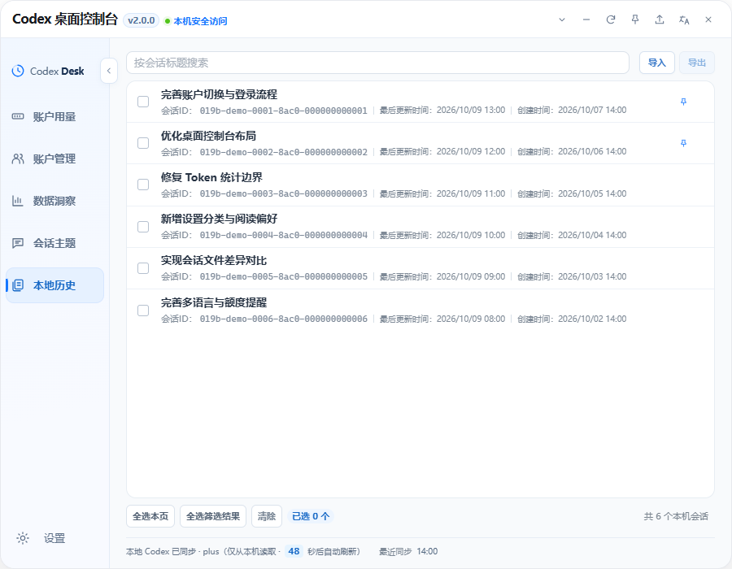

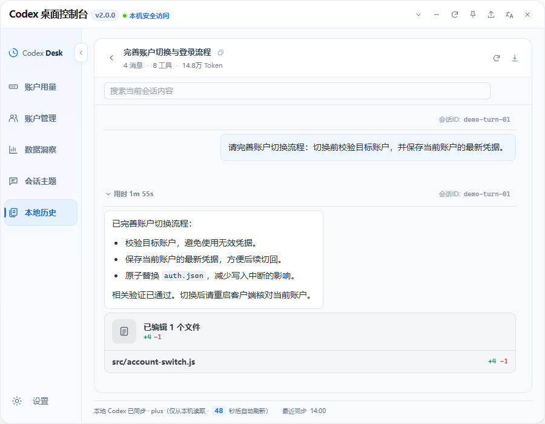

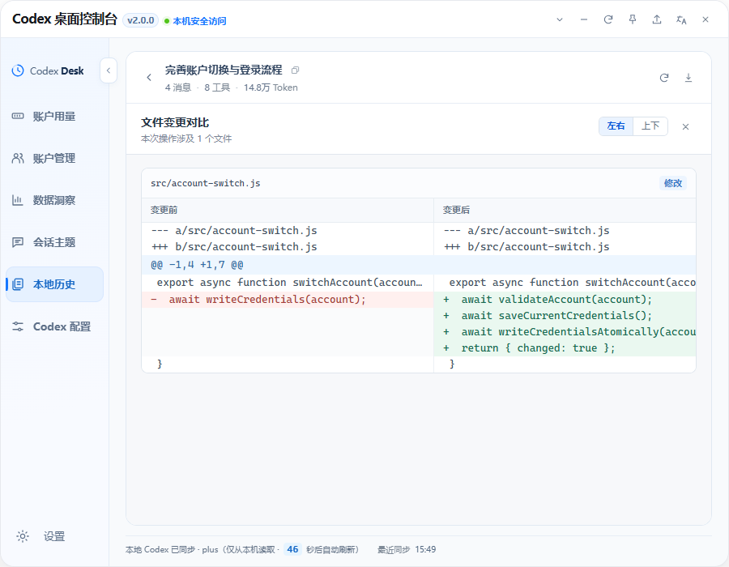

</details>

## 语言

支持简体中文、繁體中文、English、日本語和한국어，可在标题栏选择语言或跟随系统。

## 数据与账户

额度与会话数据来自本机 Codex 服务和文件。账户凭据仅在本机保存，不传入页面、日志或上传；版本检查请求 GitHub 公开信息。

账户库为与 Codex 目录同级的 `.codex-desk/saved-accounts.json` 明文文件，请妥善保管。旧账户库不迁移。Windows 偏好设置和 WebView 缓存位于 `.codex-desk/webview/main`，旧偏好及会话固定记录不迁移。

账户切换需要 `cli_auth_credentials_store = "file"`；其他存储模式需先启用文件管理并重新登录。切换后请重启客户端核对，可选重启共享服务可能影响其他客户端。移除已保存账户不会注销当前登录。

## 统计口径

- 趋势图可展示最近 3、7 或 30 个自然日。消息按所属回合的时间归档；回合时间缺失时，才使用会话最后更新时间作为回退。
- 趋势只读取最近更新的最多 100 个本机非归档会话，避免为历史会话进行大量详情读取；会话列表、搜索和导出不受这个 100 条范围限制。
- 趋势的“消息”仅统计可识别的用户消息和 Codex 回复。每个会话最多纳入最新 500 条消息；详情页可继续分页读取更早的历史。
- 详情页初次展示最近一页回合；更早记录按需加载。未读取完整历史时，洞察数字标注为“已加载记录”；展开概览侧栏后再汇总完整会话。
- 趋势数据缓存 60 秒；手动刷新会跳过缓存并重新聚合。

## 会话导入与导出

在“本地历史”勾选会话后导出，或选择 Codex Desk v1 会话包导入。每条导入记录会创建新会话，重复导入会产生重复记录，也可能消耗少量额度。

会话包仅包含对话文本，不包含认证信息、工具调用、文件差异或完整运行状态。文件为未加密 JSON；单文件最大 64 MB，单次最多 5,000 个会话，不支持原始 Codex JSONL。

## 运行要求

- Node.js 24 或更高版本（仅开发、打包 Codex Desk 所需；Codex CLI 的依赖取决于其安装方式）
- Rust（仅开发、打包所需）：使用 `rustup` 安装稳定版工具链
- 已安装并登录 **Codex CLI ≥ 0.157.0**
- Windows 需要 WebView2（Windows 10/11 通常已内置）

> 需要单独安装 Codex CLI，ChatGPT 桌面客户端不能替代它。

### 本机服务

Desk 自动启动或复用 Codex 共享 daemon。退出 Desk 或更改 CLI 路径不会停止该服务。

使用 `codex --version` 检查版本；需要升级时执行 `npm install -g @openai/codex@latest`。

## 开发启动

```powershell
Set-Location "<Codex Desk 项目目录>"
npm install
npm run tauri dev
```

如果 PowerShell 提示找不到 `cargo`，请确认已通过 `rustup` 安装 Rust，重新打开终端后执行 `cargo --version` 检查环境变量。

macOS 的同一项目可直接执行：

```bash
cd <Codex Desk 项目目录>
npm install
npm run tauri dev
```

## 打包

发布信息统一维护在仓库根目录的 `version.json`。新版本发布前只需修改其中的版本号、发布日期和多语言更新说明，Tauri、安装包、Codex app-server 客户端和更新检查都会读取该文件。

推送与版本号一致的 `v<版本号>` 标签后，GitHub Actions 会构建各平台安装包，并从该标签下的 `version.json` 生成中英文 Release 正文。应用更新检查直接读取 `main` 分支的版本文件，合并版本信息后应及时推送标签，并确认各平台构建成功、Release 安装包上传齐全。

```powershell
npm run tauri build
```

输出位置：`src-tauri/target/release/bundle/`。Windows 可得到安装包，macOS 可构建 `.app`/`.dmg`；向其他 macOS 用户分发前通常需要 Apple 签名和公证。

## 使用方式

- 通过侧栏切换页面，在底部打开设置。
- 在账户管理中登录、保存或切换账户。
- 搜索本地会话，在详情页复制 `codex resume <会话 ID>` 命令继续会话。
- 标题栏可刷新、置顶或收起为悬浮球。
- 默认每 60 秒自动刷新，底栏显示倒计时；托盘菜单可重新打开或退出应用。
